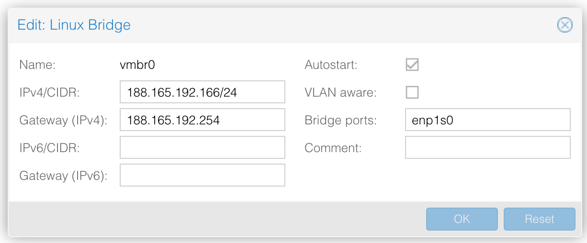
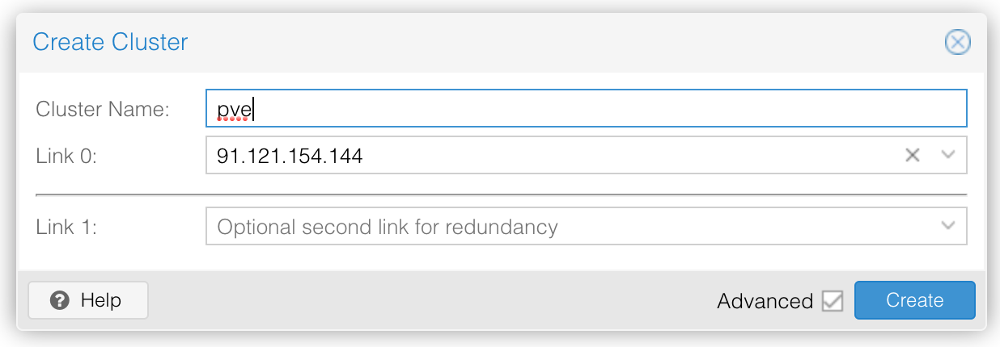
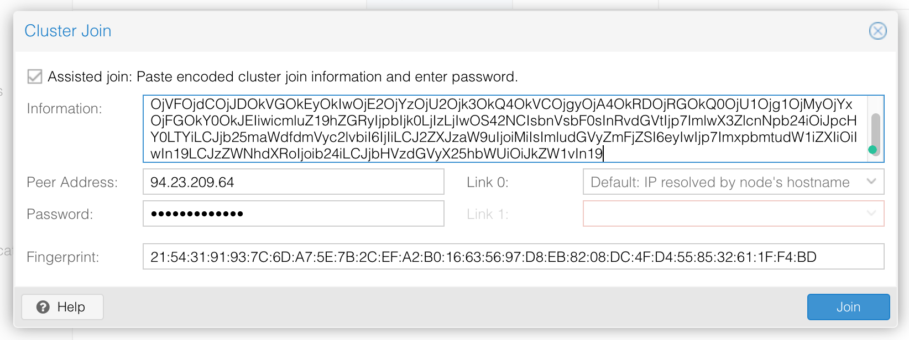
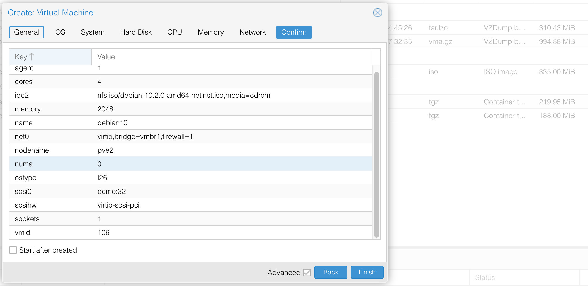
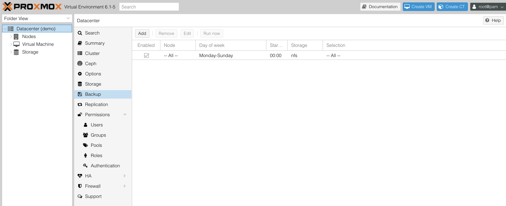
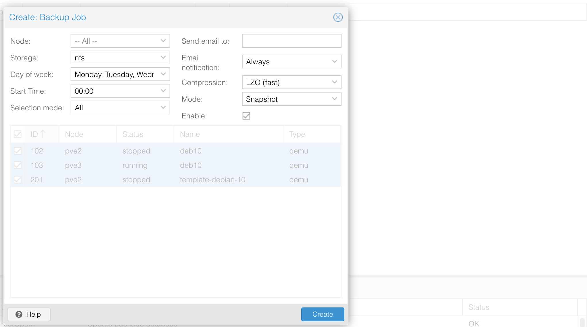
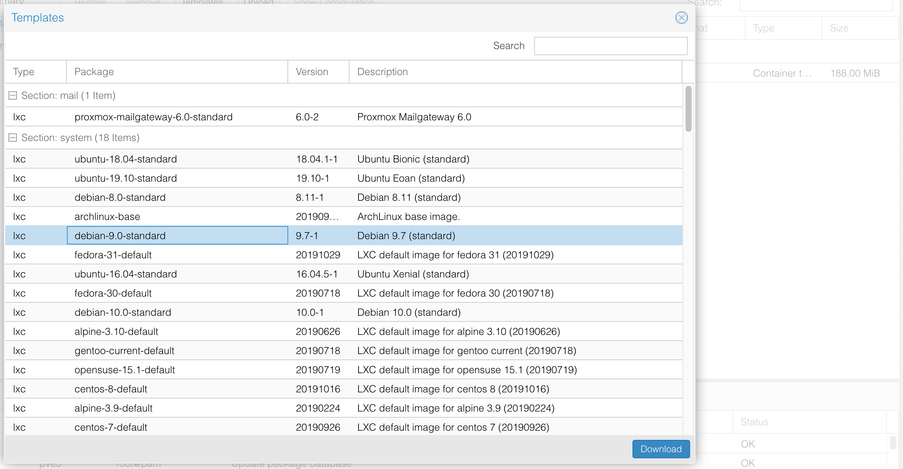
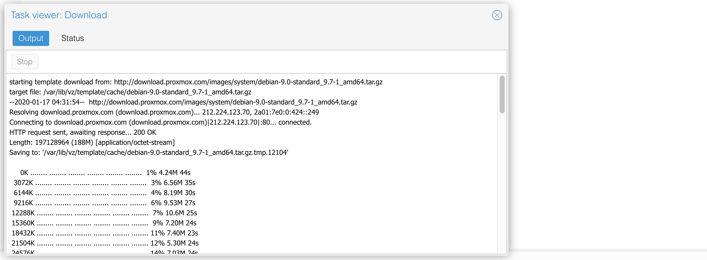
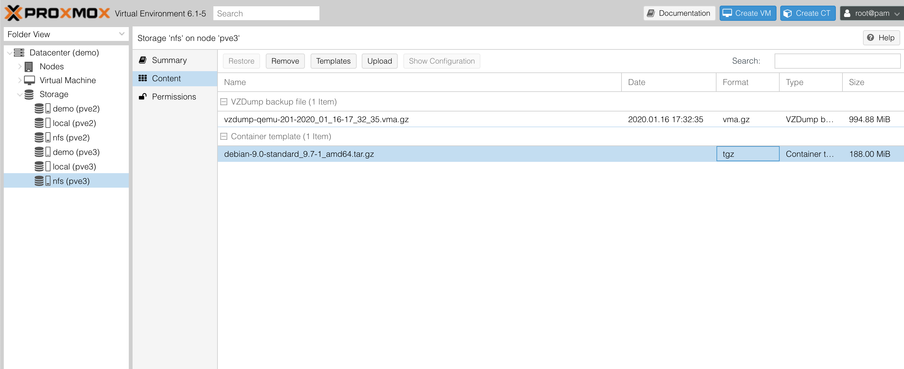
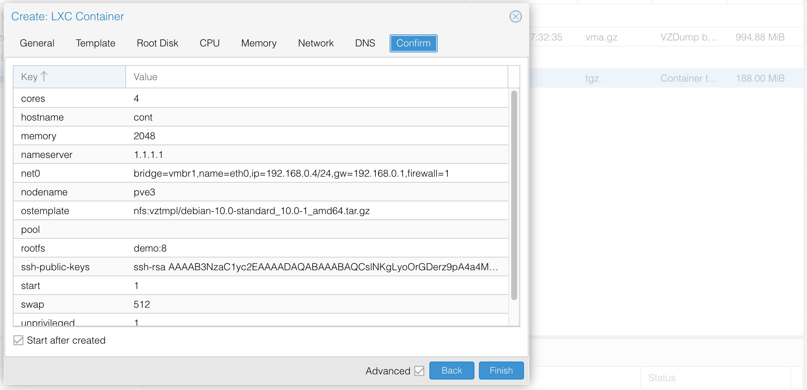

[Ondrej Sika (sika.io)](https://sika.io) | <ondrej@sika.io> | [go to course ->](#course)


# Proxmox Training

    2019 Ondrej Sika <ondrej@ondrejsika.com>
    https://github.com/ondrejsika/proxmox-training

## About Me - Ondrej Sika

__DevOps Engineer, Consultant & Lecturer__

Git, Gitlab, Gitlab CI, Docker, Kubernetes, Terraform, Prometheus, ELK / EFK

## Star, Create Issues, Fork, and Contribute

Feel free to star this repository or fork it.

If you found bug, create issue or pull request.

Also feel free to propose improvements by creating issues.

## Live Chat

For sharing links & "secrets".

<https://tlk.io/sika-proxmox>


## Course

## Agenda

- Introduction to Virtualization, KVM & Proxmox
- Proxmox Node Setup
- Cluster Setup
- Storage
    - Local
    - NFS
    - ZFS
    - CEPH
- Virtual Machines
    - Create VM
    - Cloud Init
    - Snapshots
    - Backup / Restore
    - Replication
    - Migrations between Nodes
- LXC Containers
- Datacenter
    - Scheduled Backups
    - HA
    - Permissions
- Beer!


## Proxmox Features

- KVM & LXC Virtualization
- Web Interface, API, CLI & Terraform Support
- HA, Multi Master
- Many storage plugins (NFS, CIFS, GlusterFS), built-in CEPH

## Demo Proxmox

- GUI:
  - https://pve1.sikademo.com:8006
  - https://pve2.sikademo.com:8006
  - https://pve3.sikademo.com:8006
- Username: `root`
- Password: __you get a password at the course__

## Terminology

- PVE - Proxmox Virtual Environment
- Node - Physical node which runs Proxmox & KVM
- VM - Virtual Machine
- CT - LXC Container

## Node Setup

1. SSL
2. Network
3. NAT
4. Port Forwarding

### SSL

You have to setup Let's encrypt certificates on GUI proxy on port 8006

Go to __Node (demo)__ -> __System__ -> __Certificates__, setup domains & LE account and generate certificates.

### Network

You have to create network for you VMs.

Go to __Node (demo)__ -> __System__ -> __Network__

Ensure static IP on default bridge (vmbr0) and bridged ports to active network device (enp1s0).



Help:

```
# Get IP & Mask
ip a

# Get default route
ip route | grep default
```

Create new bridge for VMs network.


### NAT

If you have only one public IP address you have to set up NAT.

Create IP Tables rule on your node

```
iptables -t nat -A POSTROUTING -s '192.168.0.0/24' -o vmbr0 -j MASQUERADE
echo 1 > /proc/sys/net/ipv4/ip_forward
```

### Port Forward

You can setup port forward into VMs, for example ssh & web

```
iptables -t nat -A PREROUTING -i vmbr0 -p tcp --dport 80 -j DNAT --to 192.168.0.3:80
iptables -t nat -A PREROUTING -i vmbr0 -p tcp --dport 443 -j DNAT --to 192.168.0.3:443

iptables -t nat -A PREROUTING -i vmbr0 -p tcp --dport 9902 -j DNAT --to 192.168.0.2:22
iptables -t nat -A PREROUTING -i vmbr0 -p tcp --dport 9903 -j DNAT --to 192.168.0.3:22
iptables -t nat -A PREROUTING -i vmbr0 -p tcp --dport 9904 -j DNAT --to 192.168.0.4:22
iptables -t nat -A PREROUTING -i vmbr0 -p tcp --dport 9905 -j DNAT --to 192.168.0.5:22
iptables -t nat -A PREROUTING -i vmbr0 -p tcp --dport 9906 -j DNAT --to 192.168.0.6:22
iptables -t nat -A PREROUTING -i vmbr0 -p tcp --dport 9907 -j DNAT --to 192.168.0.7:22
iptables -t nat -A PREROUTING -i vmbr0 -p tcp --dport 9908 -j DNAT --to 192.168.0.8:22
iptables -t nat -A PREROUTING -i vmbr0 -p tcp --dport 9909 -j DNAT --to 192.168.0.9:22
```

## Cluster

You need Proxmox Cluster for:

- CEPH
- HA
- Replication

### Create Cluster



### Copy Join Info


### Join Cluster



## Storage

### Directory

Path on node's filesystem

### NFS

Run NFS server, for example `nfs.sikademo.com` ([Terraform Manifest](https://github.com/ondrejsika/terraform-demo-nfs))

#### Add NFS storage to storage configuration

Got to __Datacenter__ -> __Storage__ and add NFS.


Now, you can store CD Images, Disk Images & Backups on NFC.

#### Copy Local ISO Image to NFS storage

```
cp /var/lib/vz/template/iso/<iso_image> /mnt/pve/<storage_name>/template/iso/
```

Example

```
cp /var/lib/vz/template/iso/debian-10.2.0-amd64-netinst.iso /mnt/pve/nfs/template/iso/
```

### ZFS

Why Proxmox with ZFS:

- Replication between nodes (partional updates by zfs send)
- Easy Migration between nodes

ZFS Features:

- Snapshots
- ZFS Sync

ZFS Resources:

- https://pve.proxmox.com/wiki/ZFS_on_Linux
- https://www.howtoforge.com/tutorial/how-to-use-snapshots-clones-and-replication-in-zfs-on-linux/


### Ceph

Why Proxmox with Ceph:

- HA VMs
- Build in Ceph Custer (easy setup)

#### What is Ceph

> Ceph is a open source storage platform, implements object storage on a single distributed computer cluster, and provides interfaces for object-, block- and file-level storage. Ceph aims primarily for completely distributed operation without a single point of failure, and scalable to the exabyte level. -- [wikipedia](https://en.wikipedia.org/wiki/Ceph_(software))

#### Resources

- Proxmox VE Ceph Benchmark 2018/02 - <https://www.proxmox.com/en/downloads/item/proxmox-ve-ceph-benchmark>


## Virtual Machines

### Create VM



#### In CLI

```
qm create <vmid> [ARGS]
```

Example

```
qm create 104 --cdrom local:iso/debian-10.2.0-amd64-netinst.iso --name demo --net0 virtio,bridge=vmbr0 --virtio0 local:10,format=qcow2 --bootdisk virtio0 --ostype l26 --memory 1024 --onboot no --sockets 1
```

[more](https://pve.proxmox.com/wiki/Qemu/KVM_Virtual_Machines#_managing_virtual_machines_with_tt_span_class_monospaced_qm_span_tt)


### Install Qemu Agent

```
apt-get install qemu-guest-agent
```

### Clone

```
qm clone <sourcevmid> <targetvmid>
```

Example

```
qm clone 100 105
```

### Cloud Init

#### Why Cloud Init?

- Configure your VM on start
- Set root password
- Add SSH key
- Configure hostname & network

#### Use Cloud Init

You have to have cloud-init installed in your template

```
apt-get install cloud-init
```

If you have cloud init installed, it will automatically run on every VM start.


### Snapshots

```
/usr/sbin/qm snapshot <vmid> <snapshot name>
```

Example

```
/usr/sbin/qm snapshot 101 Snapshot_$(date +"%Y_%m_%d_%H_%M_%S")
```

For automatic (cron) snapshots, you can use <https://github.com/kvaps/pve-autosnap>

### Backup / Restore

#### Backup

3 levels of consistency

- stop mode
- suspend mode
- snapshot mode

```
vzdump <vmid> [--mode <mode>] [--storage <storage>]
```
```
vzdump --all
```

Example

```
vzdump 100 --mode snapshot --storage nfs
```

#### Restore

```
qmrestore <file> <vmid>
```

Example

```
qmrestore 100 /mnt/pve/nfs/dump/vzdump-qemu-100-2019_11_29-06_29_48.vma
```

### Migrate VM

Requirements:

- Ditributed (eg.: CEPH) storage or __not__ replicated VM image - migration of replicated VMs is described below


### Replication

Requirements:

- Proxmox Cluster
- ZFS Storage for VM image

Resources:

- https://pve.proxmox.com/wiki/Storage_Replication


### Migrate VM Between Replicated Nodes

```
mv /etc/pve/nodes/<node>/qemu-server/<vm_id>.conf /etc/pve/nodes/<new node>/qemu-server/<vm_id>.conf
```

Example

```
mv /etc/pve/nodes/pve1/qemu-server/102.conf /etc/pve/nodes/pve2/qemu-server/102.conf
```

## Scheduled Backups

Go to __Datacenter__ -> __Backups__



### Create New Schedule Backup



## LXC Containers

### Download Templates

At first, you have to download container template.

Go to Storeage which supports Container Templates, for example local or NFS.








### Create Container

Go to __Create CT__




## Permissions

Go to __Datacenter__ -> __Permissions__

You can add permissions to other users,groups on VMs, Containers, Storage.

### Resource Pools

You can use resource pools to assign permissons (user, grout) to some resources.

### Workflow

- Create group
- Create pool
- Configure pool permissions
- Create users in Proxmox
- Create users in Linux (adduser)
- Add users to groups
- Create resource in pool / Add resource to pool


## Thank you! & Questions?

That's it. Do you have any questions? __Let's go for a beer!__

### Ondrej Sika

- email: <ondrej@sika.io>
- web: <https://sika.io>
- twitter: 	[@ondrejsika](https://twitter.com/ondrejsika)
- linkedin:	[/in/ondrejsika/](https://linkedin.com/in/ondrejsika/)

_Do you like the course? Write me recommendation on Twitter (with handle `@ondrejsika`) and LinkedIn (add me [/in/ondrejsika](https://www.linkedin.com/in/ondrejsika/) and I'll send you request for recommendation). __Thanks__._

Wanna to go for a beer or do some work together? Just [book me](book-me.sika.io) :)


## Resources

- Proxmox Command Line Tools - <https://pve.proxmox.com/wiki/Command_line_tools>
- Backup & Restore - <https://pve.proxmox.com/wiki/Backup_and_Restore>
- Cloud Init - <https://pve.proxmox.com/wiki/Cloud-Init_Support>
- Cloud Init FAQ - <https://pve.proxmox.com/wiki/Cloud-Init_FAQ>
- Proxmox on Single IP Address - <https://www.guyatic.net/2017/04/10/configuring-proxmox-ovh-kimsufi-server-single-public-ip/>
- Persistent IP Tables Rules - <https://www.thomas-krenn.com/en/wiki/Saving_Iptables_Firewall_Rules_Permanently>
- Install Proxmox on Debian - <https://computingforgeeks.com/how-to-install-proxmox-ve-on-debian/>
- Upgrade from 5.x to 6.0 - <https://pve.proxmox.com/wiki/Upgrade_from_5.x_to_6.0>
- ZFS on Linux (Proxmox Wiki) - <https://pve.proxmox.com/wiki/ZFS_on_Linux>
- Snapshots, Clones & Replication in ZFS on Linux - <https://www.howtoforge.com/tutorial/how-to-use-snapshots-clones-and-replication-in-zfs-on-linux/>
- Proxmox VE Ceph Benchmark 2018/02 - <https://www.proxmox.com/en/downloads/item/proxmox-ve-ceph-benchmark>
