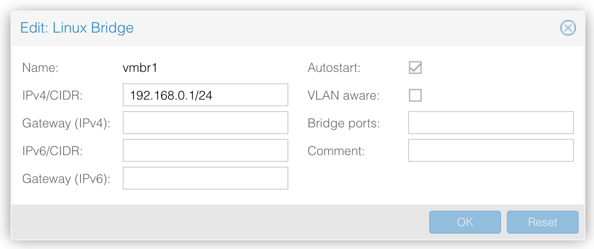
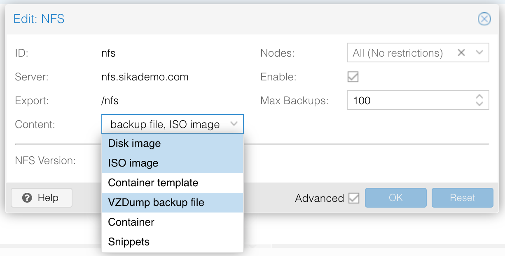

[Ondrej Sika (sika.io)](https://sika.io) | <ondrej@sika.io> | [go to course ->](#course)

# Proxmox Training

    2019 Ondrej Sika <ondrej@ondrejsika.com>
    https://github.com/ondrejsika/proxmox-training

## Course

## Agenda

- Introduction to Virtualization, KVM & Proxmox
- Proxmox Node Setup
- Storage Setup
- Virtual Machines
- LXC Containers

## Proxmox Features

- KVM & LXC Virtualization
- Web Interface, API, CLI & Terraform Support
- HA, Multi Master
- Many storage plugins (NFS, CIFS, GlusterFS), built-in CEPH

## Demo Proxmox

- GUI: <https://pve1.sikademo.com:8006>
- Username: `root`
- Password: `training2019`


## Terminology

- PVE - Proxmox Virtual Environment
- Node - Physical node which runs Proxmox & KVM
- VM - Virtual Machine
- CT - LXC Container

## Node Setup

1. SSL
2. Network
3. NAT
4. Port Forwarding

### SSL

You have to setup Let's encrypt certificates on GUI proxy on port 8006

Go to __Node (demo)__ -> __System__ -> __Certificates__, setup domains & LE account and generate certificates.

### Network

You have to create network for you VMs.

Go to __Node (demo)__ -> __System__ -> __Network__

Ensure static IP on default bridge (vmbr0) and bridged ports to active network device (enp1s0).


Create new bridge for VMs network.



### NAT

If you have only one public IP address you have to set up NAT.

Create IP Tables rule on your node

```
iptables -t nat -A POSTROUTING -s '192.168.0.0/24' -o vmbr0 -j MASQUERADE
echo 1 > /proc/sys/net/ipv4/ip_forward
```

### Port Forward

You can setup port forward into VMs, for example ssh & web

```
iptables -t nat -A PREROUTING -i vmbr0 -p tcp --dport 80 -j DNAT --to 192.168.0.3:80
iptables -t nat -A PREROUTING -i vmbr0 -p tcp --dport 443 -j DNAT --to 192.168.0.3:443
iptables -t nat -A PREROUTING -i vmbr0 -p tcp --dport 9902 -j DNAT --to 192.168.0.2:22
iptables -t nat -A PREROUTING -i vmbr0 -p tcp --dport 9903 -j DNAT --to 192.168.0.2:22
iptables -t nat -A PREROUTING -i vmbr0 -p tcp --dport 9904 -j DNAT --to 192.168.0.2:22
```

## Storage

### Directory

Path on node's filesystem

### NFS

Run NFS server, for example `nfs.sikademo.com` ([Terraform Manifest](https://github.com/ondrejsika/terraform-demo-nfs))

#### Add NFS storage to storage configuration

Got to __Datacenter__ -> __Storage__ and add NFS.



Now, you can store Images, Disk Images & Backups on NFC.

### Ceph

> Ceph is a open source storage platform, implements object storage on a single distributed computer cluster, and provides interfaces for object-, block- and file-level storage. Ceph aims primarily for completely distributed operation without a single point of failure, and scalable to the exabyte level. -- [wikipedia](https://en.wikipedia.org/wiki/Ceph_(software))

## Virtual Machines

### Create VM

```
qm create <vmid> [ARGS]
```

Example

```
qm create 104 --cdrom local:iso/debian-10.2.0-amd64-netinst.iso --name demo --net0 virtio,bridge=vmbr0 --virtio0 local:10,format=qcow2 --bootdisk virtio0 --ostype l26 --memory 1024 --onboot no --sockets 1
```

[more](https://pve.proxmox.com/wiki/Qemu/KVM_Virtual_Machines#_managing_virtual_machines_with_tt_span_class_monospaced_qm_span_tt)

### Clone

```
qm clone <sourcevmid> <targetvmid>
```

Example

```
qm create 100 105
```

### Snapshots

```
/usr/sbin/qm snapshot <vmid> <snapshot name>
```

Example

```
/usr/sbin/qm snapshot 101 Snapshot_$(date +"%Y_%m_%d_%H_%M_%S")
```

For automatic (cron) snapshots, you can use <https://github.com/kvaps/pve-autosnap>

### Backup / Restore

#### Backup

3 levels of consistency

- stop mode
- suspend mode
- snapshot mode

```
vzdump <vmid> [--mode <mode>] [--storage <storage>]
```
```
vzdump --all
```

Example

```
vzdump 100 --mode snapshot --storage nfs
```

#### Restore

```
qmrestore <file> <vmid>
```

Example

```
qmrestore 100 /mnt/pve/nfs/dump/vzdump-qemu-100-2019_11_29-06_29_48.vma
```

## Resources

- Proxmox Command Line Tools - <https://pve.proxmox.com/wiki/Command_line_tools>
- Backup & Restore - <https://pve.proxmox.com/wiki/Backup_and_Restore>
- Cloud Init - <https://pve.proxmox.com/wiki/Cloud-Init_Support>
- Cloud Init FAQ - <https://pve.proxmox.com/wiki/Cloud-Init_FAQ>
- Proxmox on Single IP Address - <https://www.guyatic.net/2017/04/10/configuring-proxmox-ovh-kimsufi-server-single-public-ip/>
- Persistent IP Tables Rules - <https://www.thomas-krenn.com/en/wiki/Saving_Iptables_Firewall_Rules_Permanently>
- Install Proxmox on Debian - <https://computingforgeeks.com/how-to-install-proxmox-ve-on-debian/>
- Upgrade from 5.x to 6.0 - <https://pve.proxmox.com/wiki/Upgrade_from_5.x_to_6.0>

## Thank you & Questions

### Ondrej Sika

- email:	<ondrej@sika.io>
- web:	<https://sika.io>
- twitter: 	[@ondrejsika](https://twitter.com/ondrejsika)
- linkedin:	[/in/ondrejsika/](https://linkedin.com/in/ondrejsika/)

_Do you like the course? Write me recommendation on Twitter (with handle `@ondrejsika`) and LinkedIn (add me [/in/ondrejsika](https://www.linkedin.com/in/ondrejsika/) and I'll send you request for recommendation). __Thanks__._
